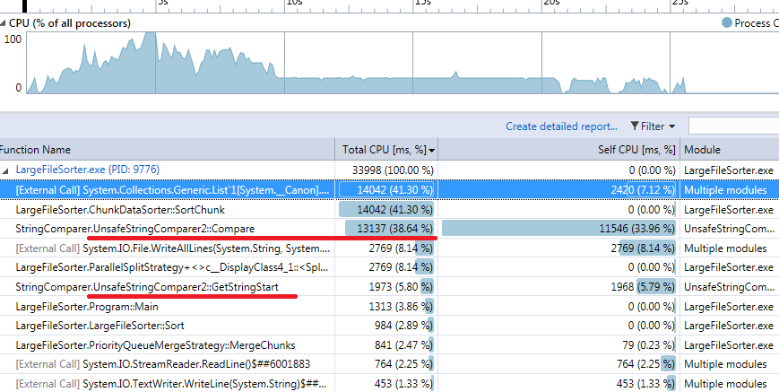

#Large text file generator and external sorter 

##Overview
Solution implemets classical approach to external sorting. 
###Split
At a first step file is split to chunks. Chunk size depends on the memory limit, which is either provided as a command line argument, or calculated by split strategy itself. SyncSplitStrategy uses Max(AvailablePhysicalMemory, TotalPhysicalMemory / 8) bytes, while ParallelSplitStrategy, which simultaneously sorts chunks on available processor cores, sets memory limit for each chunk to Max(AvailablePhysicalMemory, TotalPhysicalMemory / 8) / ProcessorCount

Sorted chunks are stored do disk, until Merge phase begins.

###Merge
Merge is currently performed in a single pass. All chunk files are opened and starting line is read from each of them and is put to container. In PriorityQueueMergeStrategy C5.IntervalHeap is used as a container while in SortedDictionaryMergeStrategy it is standard SortedDictionary. The idea here is that container sorts it's elements and we can pop the minimal element from the container, write it to the output file and then read the next element from the stream associated with that minimal element, put it to container and so on.
Complexity of both containers is O(NlogN)

###String comparison
In test file strings have format "{Number}. {String}" and should be sorted first by _String_ part, and then by _Number_. To leverage standard .NET infrastructure, custom comparers that implement IComparer<string> interface were implemented. It is obvious, that the main bottleneck in both sorting and merging is string comparison. 

So some experiments were made to implement the fastest string comparer for the format described. About ~5x perfomance boost was achieved thanks to optimization. From the other hand UnsafeStringComparer2 relies heavily on the correct data format and will crash and application if a string in an incorrect format is present. SimpleStringComparer should be used in this case. 

**SimpleStringComparer:**
Chunks created(00:01:03.4133307)
Merged:00:00:49.1676946
Total:00:01:52.5874163

**UnsafeStringComparer2:**
Chunks created(00:00:09.9710161)
Merged:00:00:11.2939598
Total:00:00:21.2716718

String comparers implemented as plugins and the assembly with comparer is resolved in a run time. Due to this it is possible to sort strings with different formats. 

###Solution structure
To simplify experiments functionality is split according to Strategy pattern, and Autofac IoC container to supply required dependencies. LargeFileSorter class acts as a composition root.

##How to run
Rebuild solution all required files will be copied to /Bin folder. Then edit and run /Bin/!generate.bat and then /Bin/!sort.bat

##Components

###LargeFileGenerator###
Utility used to generate the file
Usage: LargeFileGenerator.exe <path to generated file> <desired file size in megabytes>

###LargeFileSorter###
Usage: LargeFileSorter.exe <path to source file> <path to destination file>

Optional parameters:
/comparer:<comparer>.dll -- Custom assembly for comparing strings");
/memLimit:<number in megabytes> -- Amount of memory allowed to use by app. If not set then default value is calculated
/splitStrategy:<SyncSplitStrategy or ParallelSplitStrategy> -- sort chunks in multiple threads or in one
/mergeStrategy:<PriorityQueueMergeStrategy or SortedDictionaryMergeStrategy> -- k-Way merge is based on Sorted Dictionary or C5.PriorityQueue
/compareWith:<path to another file> -- compare current sorted file with another for testing purposes

Example:
LargeFileSorter.exe "d:\large_file.txt" "d:\large_file_sorted.txt" /comparer:"UnsafeStringComparer2.dll" /memLimit:80 /splitStrategy:ParallelSplitStrategy /mergeStrategy:PriorityQueueMergeStrategy /compareWith:"d:\large_file_sorted0.txt"

